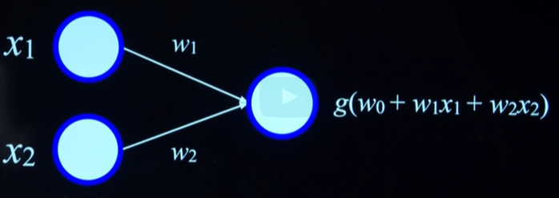

## Artificial Neural Network
A simple neural network consists of input units, weighted connections, and an output unit. Each unit computes a weighted sum of inputs, adds a bias, and applies an activation function (e.g., step, sigmoid, Rectified linear unit - ReLU) to determine the output.

## Activation Functions
