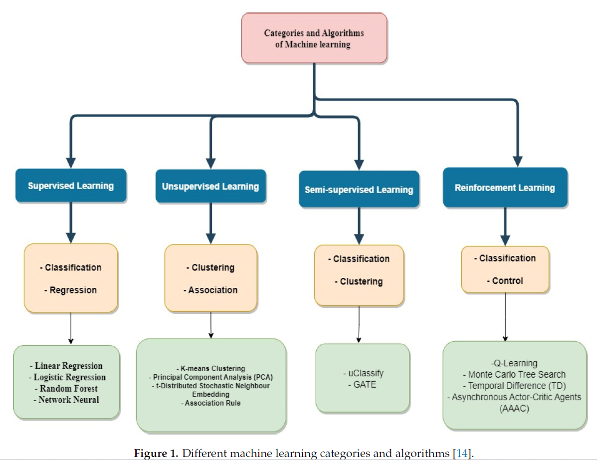
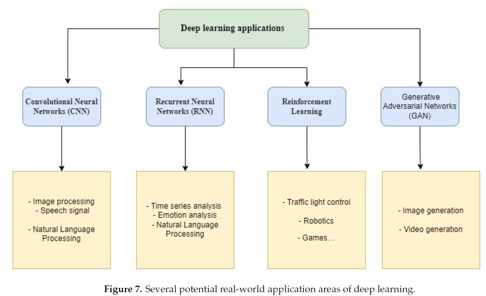

# ml-walkthrough

## Basics first

Read more in the pdf [paper](computers-12-00091.pdf).

## Anomaly detection
As a first step in the exploration, I'm gonna try this GCP [blog](https://cloud.google.com/blog/products/data-analytics/bigquery-ml-unsupervised-anomaly-detection). This utilizes BQML.
It leverages unsupervised machine learning to help you detect anomalies without needing labeled data. Depending on whether or not the training data is time series, users can now detect anomalies in training data or on new input data using a new ML.DETECT_ANOMALIES function (documentation), with the following models:

- Autoencoder model, now in Public Preview (documentation)
- K-means model, already GA (documentation)
- ARIMA_PLUS time series model, already GA (documentation)

to be continued...
