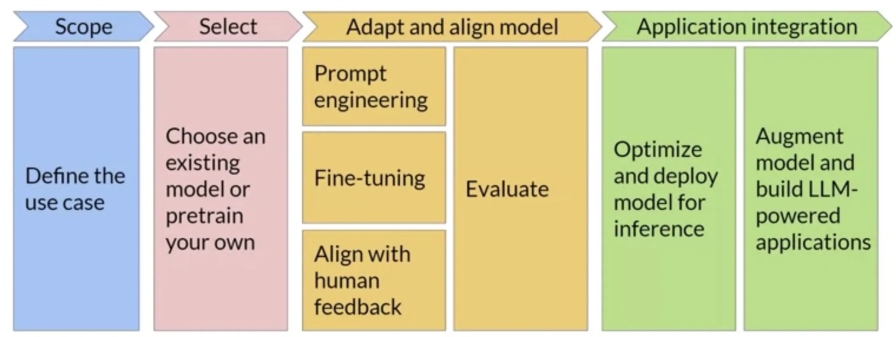

# Generative AI Project Life Cycle

 

- **Scope:** define clear and narrow scope. Decide if it is a general task or specific task.
- **Select:** Choose a model or pretrain your — existing one or train from scratch
- **Adapt and align model:** develop and align model to design with Prompts, fine tune and evaluate for best output
- **Application integration:** optimize and deploy models for inference, build LLM powered applications
